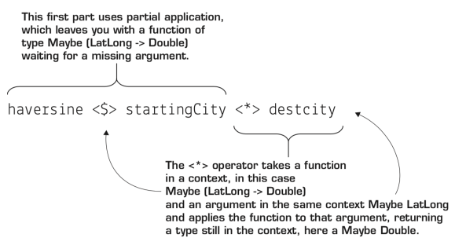

# Functional Programming - Applicative

The key method behind **Functor** is **fmap** (more commonly, the **<$>** operator), which works just like
**map** on a list. The more powerful **Applicative** type class extends the power of Functor by allowing you to use functions that are themselves in a context. One such application of Applicative, is to handle missing data.

## Example

```haskell
import qualified Data.Map.Strict as Map

type LatLong = (Double, Double)

locationsDB :: Map.Map String LatLong
locationsDB = Map.fromList [
    ("Arkham", (42.6054, -70.7829)),
    ("Innsmouth", (42.8250, -70.8150)),
    ("Carcosa", (29.9714, -90.7694)),
    ("New York", (40.7776, -73.9691))
  ]
  
haversine :: LatLong -> LatLong -> Double

startingCity = Map.lookup "Carcosa" locationDB

destCity = Map.lookup "Innsmouth" locationDB

haversine <$> startingCity <*> destCity
```

where:

> 