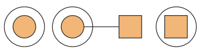

# Functional Programming

As long as your function (connector) matches, you can make the transformation you want:

> 

This connector can represent any function from one type to another. e.g

Int -> Double

We visualize placing a connector between the initial shape (in this case, a circle) and the desired shape (a square).

The above idea works when the source and target shapes are within some **context** so long as the connector matches:

> 

... but what about when we have a mismatch? And there are different mismatches such as connector does not match on the right, or both ends don't match etc. This is where type classes associated with category theory step in - in particular Functor, Applicative and Monad.

You can think of these type classes as adapters that allow you to work with different connectors so long as the underlying types (circle and square) are the same.

## Functor

The Functor type class solves the following mismatch between types in a context and a connector:

> 

The Functor type class requires only one definition: fmap

> 

So fmap provides an adapter:

> 

Noting that <$> is a synonym for fmap (except it’s a binary operator rather than a function).

One way to think of the Functor type class is as "things that can be mapped over".

The Functor type class allows you to apply an ordinary function to values inside a container (for example, List) or a context (for example, IO or Maybe).

## Applicative

The Applicative type class solves the following mismatches between types in a context and a connector:

> 

> 

## Monad

The Monad type class solves the following mismatch between types in a context and a connector:

> 

i.e. the Monad type class provides an adapter for this final possible mismatch.